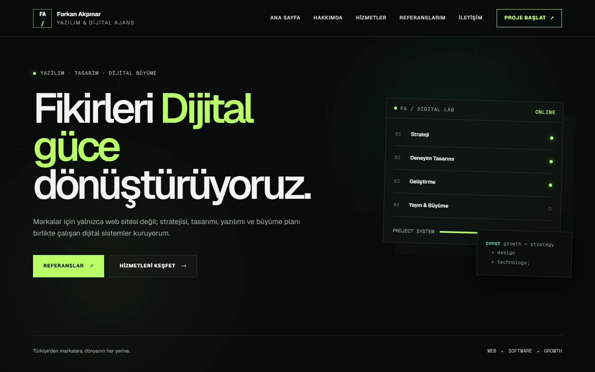
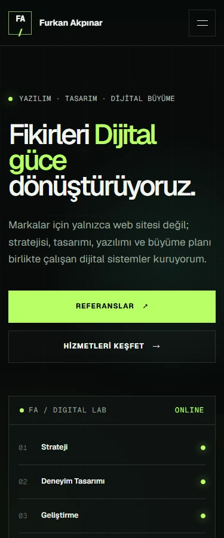
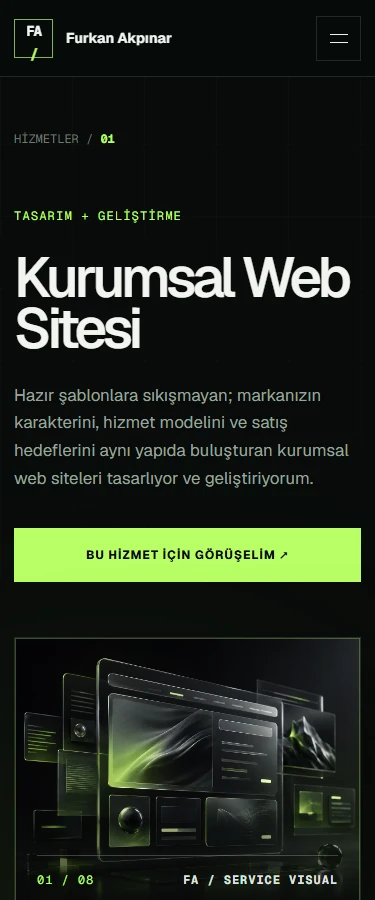

<p align="center">
  
</p>

<h1 align="center">Furkan Akpınar</h1>

<p align="center">
  <strong>Yazılım &amp; Dijital Ajans</strong><br />
  Fikirleri dijital güce dönüştüren tasarım, yazılım ve büyüme yaklaşımı.
</p>

<p align="center">
  <a href="https://furkan-akpinar-dijital-ajans.furkan-akpinar.workers.dev"><strong>Canlı siteyi ziyaret et ↗</strong></a>
</p>

<p align="center">
  
  
  
  <a href="https://github.com/furkan-akpinar/furkan-akpinar-dijital-ajans/actions/workflows/quality.yml"></a>
</p>

<p align="center">
  <a href="#ekran-görüntüleri">Ekran görüntüleri</a> ·
  <a href="#öne-çıkanlar">Öne çıkanlar</a> ·
  <a href="#teknoloji">Teknoloji</a> ·
  <a href="#kurulum">Kurulum</a> ·
  <a href="#kontroller">Kontroller</a>
</p>

---

Yazılım ve dijital ajans hizmetlerini, çalışma yaklaşımını ve portföy projelerini bir araya getiren Türkçe web sitesi. Koyu zemin, yeşil vurgular ve güçlü tipografi; ana sayfadan hizmet detaylarına kadar ortak bir görsel dil oluşturur.

## Ekran görüntüleri

10 Eylül 2026'da çalışan yerel üretim çıktısından alınan gerçek ekran görüntüleri. Masaüstü görünümü 1440 px, mobil görünümler 375 px genişliğindedir.



<details>
  <summary><strong>Mobil ana sayfa ve hizmet detayı</strong></summary>
  <br />
  <p align="center">
    
    &nbsp;
    
  </p>
</details>

## Öne çıkanlar

- **13 sayfa:** ana sayfa, hakkımda, hizmetler, sekiz hizmet detayı, referanslar ve iletişim.
- **Hizmet odaklı içerik:** kapsam, beklenen sonuçlar ve açılır sık sorulan sorular alanları.
- **Yedi portföy projesi:** proje açıklamaları, etiketler ve görsel önizlemeler.
- **Duyarlı arayüz:** masaüstü, tablet ve mobil düzenler; sayfa geçişinde ve Escape ile kapanan mobil menü.
- **Erişilebilir etkileşimler:** klavye gezinmesi, görünür odak, içeriğe geçiş bağlantısı, azaltılmış hareket desteği ve animasyon durdurma kontrolü.
- **Yerel varlıklar:** optimize WebP görseller, Geist ve Geist Mono fontları; sayfaya özel başlıklar, açıklamalar ve özel 404 ekranı.

## Teknoloji

| Katman | Kullanılan yapı |
| --- | --- |
| Arayüz | React 19, TypeScript 5.9 |
| Uygulama | Vinext 1.0.0-beta.6 ile Next.js App Router API'leri |
| Derleme ve çalışma zamanı | Vite 8, Cloudflare Vite eklentisi, Cloudflare Workers |
| Tasarım | Tailwind CSS 4, özel CSS, yerel Geist fontları |
| Kalite | ESLint, TypeScript, Node.js test çalıştırıcısı, Playwright, GitHub Actions |

`next/*` importları Vinext uyumluluk katmanını kullanır. Derleme ve sunucu komutları Vinext üzerinden çalışır. Kesin bağımlılık sürümleri [package.json](package.json) ve [package-lock.json](package-lock.json) içinde tutulur.

## Kurulum

**Node.js 22.13+** ve npm gerekir.

```sh
git clone https://github.com/furkan-akpinar/furkan-akpinar-dijital-ajans.git
cd furkan-akpinar-dijital-ajans
npm ci
npm run dev
```

Geliştirme sunucusu: `http://localhost:3000`. `npm ci`, kilit dosyasındaki bağımlılıkları kullanılan işletim sistemi için kurar.

### Üretim derlemesi

```sh
npm run build
npm run start -- --port 3001
```

Yerel Node üretim önizlemesi: `http://localhost:3001`. Derleme, Worker paketini de doğrular.

## Kontroller

```sh
npm run lint
npm run typecheck
npm test
npx playwright install chromium
npm run test:e2e
```

| Komut | Kapsam |
| --- | --- |
| `npm run lint` | ESLint; uyarılar da hata kabul edilir |
| `npm run typecheck` | TypeScript tip kontrolü |
| `npm test` | Üretim derlemesi, paket doğrulaması ve 16 HTML testi |
| `npm run test:e2e` | Chromium'da 50 tarayıcı testi; sayfalar, gezinme, görseller, klavye, SSS, animasyonlar ve 404 |
| `npm run validate:artifact` | Mevcut üretim paketinin tekrar doğrulanması |

Tarayıcı testleri önceden derlenmiş çıktıyı kullanır ve 4173 portunda sunucuyu kendisi başlatır. Düzen kontrolleri 320, 375, 768, 1024 ve 1440 px genişliklerini kapsar. [Quality iş akışı](.github/workflows/quality.yml), Windows ve Linux'ta kaynak kontrollerini ve üretim testlerini; Linux'ta ayrıca tarayıcı testlerini ve bağımlılık güvenlik denetimini çalıştırır.

## Proje yapısı

```text
app/          Sayfalar, metadata, ortak stiller ve 404
components/   Gezinme, kartlar, form ve ortak arayüz alanları
lib/          Hizmet, proje ve gezinme içerikleri
public/       Favicon, WebP görseller ve lisanslı yerel fontlar
worker/       Cloudflare Worker giriş noktası
build/        Yayın paketleme eklentisinin kaynak kodu
scripts/      Çalıştırma ve paket doğrulama komutları
tests/        Üretim HTML ve tarayıcı testleri
docs/         README ekran görüntüleri
```

Hizmet ve portföy içerikleri [lib/site-data.ts](lib/site-data.ts) üzerinden düzenlenir. Proje kartlarına doğrulanmış yayın adresleri, isteğe bağlı `url` alanıyla eklenebilir.

## Yayın ve mevcut kapsam

**Canlı site:** [furkan-akpinar-dijital-ajans.furkan-akpinar.workers.dev](https://furkan-akpinar-dijital-ajans.furkan-akpinar.workers.dev)

Site Cloudflare Workers üzerinde yayımlanır. Zorunlu ortam değişkeni, veritabanı veya gizli anahtar gerekmez. `.env` dosyaları Git dışında tutulur. Canonical URL ve sitemap yapılandırması henüz eklenmemiştir.

Yayın, sunucu tarafını çalıştırabilen Cloudflare Workers altyapısını gerektirir. `dist/server/index.js` Worker girişidir; `dist/client/` statik varlıkları içerir. Yalnızca statik dosyaları GitHub Pages'e yüklemek yeterli değildir. Mevcut Sites paketleme bağlantısı [.openai/hosting.json](.openai/hosting.json) ve [build/sites-vite-plugin.ts](build/sites-vite-plugin.ts) içinde korunur; `dist/` çıktısı derleme sırasında oluşturulur.

**İletişim:** adres ve gönderim servisi daha sonra eklenecektir. Form bilgilendirme metniyle pasiftir; veri toplamaz, mesaj göndermez ve başarı bildirimi göstermez. Etkinleştirmek için gerçek iletişim bilgileri, sunucu doğrulaması ve gönderim/hata akışı tamamlanmalıdır. Portföy kartları mevcut durumda proje sunumu olarak kullanılabilir.

## Lisans ve atıflar

Proje için ayrı bir lisans dosyası tanımlanmamıştır. Üçüncü taraf bağımlılıkların lisansları ilgili paketlerde korunur. Yerel fontlar SIL Open Font License kapsamındadır: [Geist](public/fonts/geist-LICENSE.txt) · [Geist Mono](public/fonts/geistmono-LICENSE.txt).

README ekran görüntüleri bu uygulamanın kendi arayüzünden alınmıştır.

<p align="center">
  <strong>Furkan Akpınar</strong> · <a href="https://github.com/furkan-akpinar">GitHub</a>
</p>
